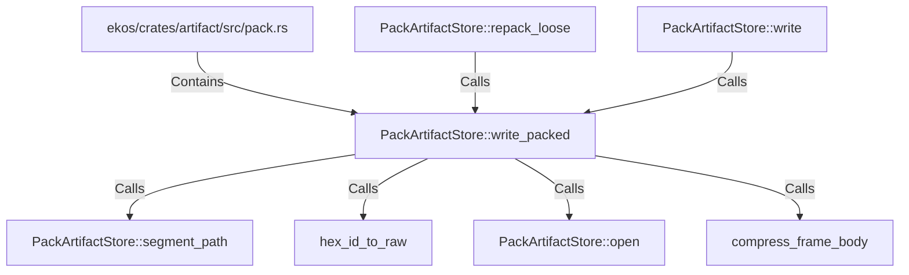

# PackArtifactStore::write_packed (RustSymbol)

## Properties

| Key | Value |
|---|---|
| `kind` | method |

## Relationships

### Calls

- ← PackArtifactStore::repack_loose (`a9bd0f7a-c0de-5f6f-8504-6946351fd959`)
- → PackArtifactStore::segment_path (`81f9c174-cef7-5857-bc30-9e1cdef8c67a`)
- → hex_id_to_raw (`e1da57b7-834b-5ec6-aaa8-ccb775efd8bc`)
- → PackArtifactStore::open (`00477147-66fe-5667-876f-59e9dc819b1c`)
- → compress_frame_body (`3ac7addf-75fc-54be-b6be-8627d750462e`)
- ← PackArtifactStore::write (`f153ee62-96d1-5be6-bdb9-249eab66c33b`)

### Contains

- ← ekos/crates/artifact/src/pack.rs (`98cd7507-d9e7-59e3-acfb-c7ffb05d9f73`)

## Diagram

## Evidence

_No evidence cited._
