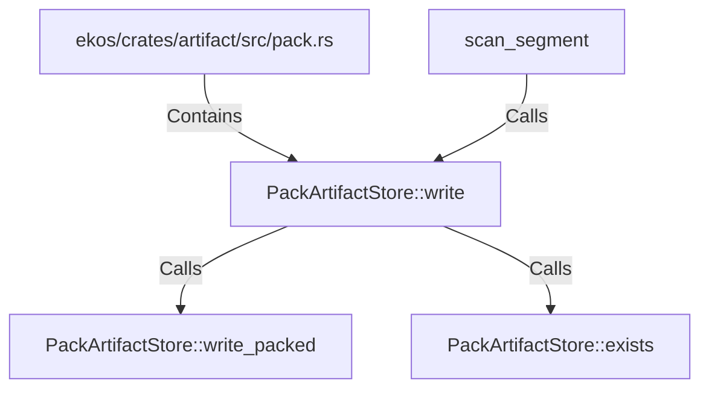

# PackArtifactStore::write (RustSymbol)

## Properties

| Key | Value |
|---|---|
| `kind` | method |

## Relationships

### Calls

- → PackArtifactStore::write_packed (`2c2ad043-598d-5fcb-bf2d-ed4347ca2ae6`)
- → PackArtifactStore::exists (`a58cd217-2bcf-5516-83b6-1a7b8db7f75e`)
- ← scan_segment (`c4b5e70f-e265-5b5b-9fa4-a7aed1ea48cf`)

### Contains

- ← ekos/crates/artifact/src/pack.rs (`98cd7507-d9e7-59e3-acfb-c7ffb05d9f73`)

## Diagram

## Evidence

_No evidence cited._
