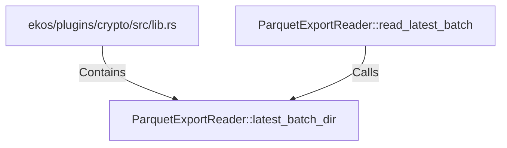

# ParquetExportReader::latest_batch_dir (RustSymbol)

## Properties

| Key | Value |
|---|---|
| `kind` | method |

## Relationships

### Calls

- ← ParquetExportReader::read_latest_batch (`573d78a3-871e-5467-b795-efe45e871700`)

### Contains

- ← ekos/plugins/crypto/src/lib.rs (`83728c61-df4d-5ad6-81c7-5bf50ff761fb`)

## Diagram

## Evidence

_No evidence cited._
