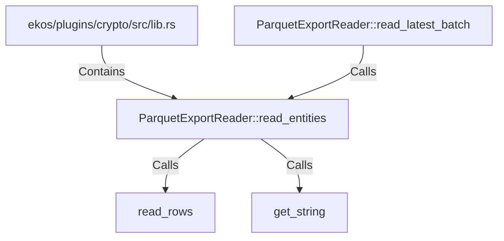

# ParquetExportReader::read_entities (RustSymbol)

## Properties

| Key | Value |
|---|---|
| `kind` | method |

## Relationships

### Calls

- → read_rows (`2bca7d5f-e455-5aea-b4d1-308424636e35`)
- → get_string (`f54fbe87-d448-5710-8990-eee46048c1d4`)
- ← ParquetExportReader::read_latest_batch (`573d78a3-871e-5467-b795-efe45e871700`)

### Contains

- ← ekos/plugins/crypto/src/lib.rs (`83728c61-df4d-5ad6-81c7-5bf50ff761fb`)

## Diagram

## Evidence

_No evidence cited._
