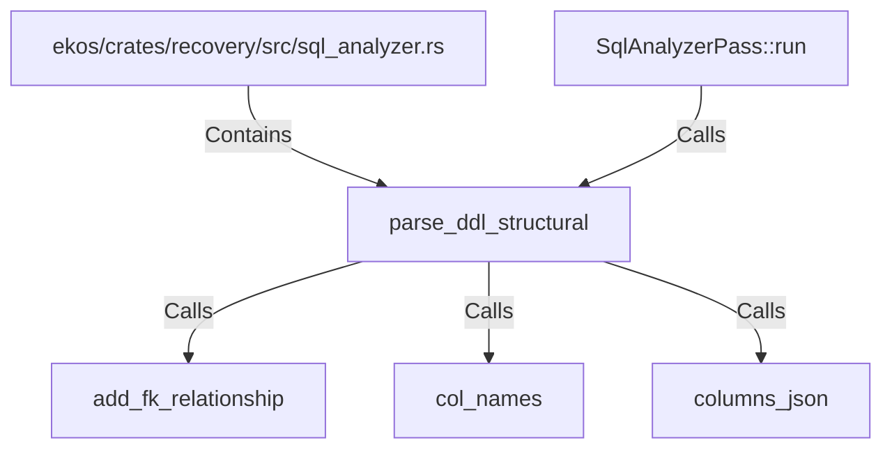

# parse_ddl_structural (RustSymbol)

## Properties

| Key | Value |
|---|---|
| `kind` | function |

## Relationships

### Calls

- ← SqlAnalyzerPass::run (`9650fe07-6a5c-57dc-9a45-705995b82a4a`)
- → add_fk_relationship (`1a03d472-0f17-5c60-ac70-af44732a3110`)
- → col_names (`60432b6b-4858-52ab-8fa5-4825c5600764`)
- → columns_json (`01ed4254-b135-5b4e-a18a-dd6e9163f9ce`)

### Contains

- ← ekos/crates/recovery/src/sql_analyzer.rs (`cd768c5e-1640-51c3-b6ec-cb7ac78ade6d`)

## Diagram

## Evidence

_No evidence cited._
