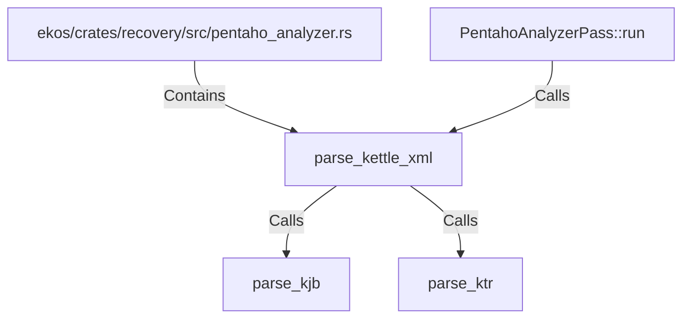

# parse_kettle_xml (RustSymbol)

## Properties

| Key | Value |
|---|---|
| `kind` | function |

## Relationships

### Calls

- ← PentahoAnalyzerPass::run (`144440b5-5a39-53d1-8f76-7f19376b0341`)
- → parse_kjb (`cc76104d-128b-5cc0-bcc8-9f5a4f895888`)
- → parse_ktr (`ac857c0a-e7e1-5b8d-972d-dd8184852f15`)

### Contains

- ← ekos/crates/recovery/src/pentaho_analyzer.rs (`ce3d2f1b-e1c6-55d7-92bc-c1b69f76dbca`)

## Diagram

## Evidence

_No evidence cited._
