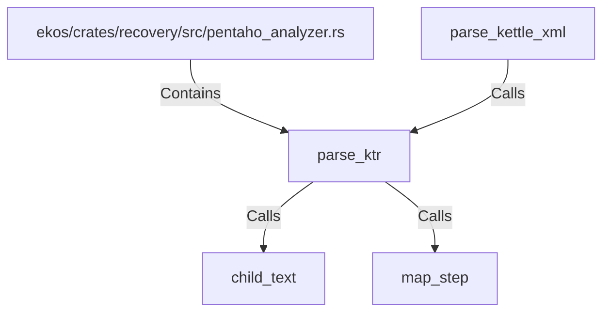

# parse_ktr (RustSymbol)

## Properties

| Key | Value |
|---|---|
| `kind` | function |

## Relationships

### Calls

- ← parse_kettle_xml (`b954f76c-b28d-578b-a82b-cf5b8d11dec0`)
- → child_text (`f70791ea-bde4-57ab-8af1-ccc69fa9f5a7`)
- → map_step (`47faefae-6222-5ae2-a4a9-9ec080997290`)

### Contains

- ← ekos/crates/recovery/src/pentaho_analyzer.rs (`ce3d2f1b-e1c6-55d7-92bc-c1b69f76dbca`)

## Diagram

## Evidence

_No evidence cited._
