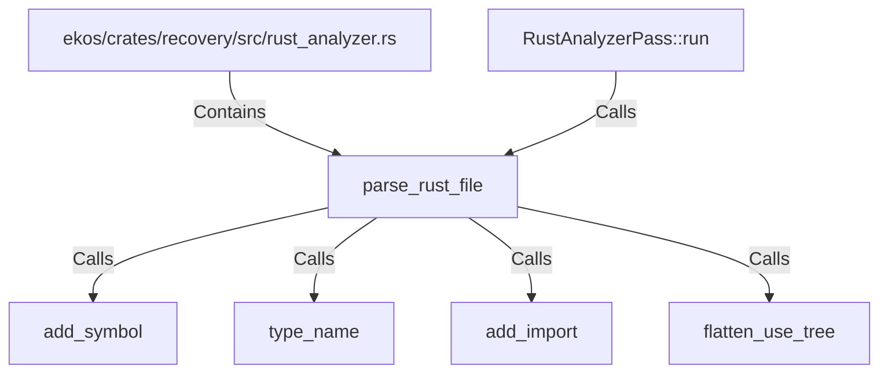

# parse_rust_file (RustSymbol)

## Properties

| Key | Value |
|---|---|
| `kind` | function |

## Relationships

### Calls

- ← RustAnalyzerPass::run (`8fb40c09-18b3-5b5a-bc8a-00f048756585`)
- → add_symbol (`18bb973a-8ef0-557c-961e-d46286fcab0f`)
- → type_name (`b2c88510-792a-5dc7-8c04-f5e81cf9e666`)
- → add_import (`40de02d0-0c8a-5907-97bf-6f15ecb5b18e`)
- → flatten_use_tree (`5a57188e-5640-5c40-8eb9-08eda1c1a388`)

### Contains

- ← ekos/crates/recovery/src/rust_analyzer.rs (`50cde56d-1f82-53a6-bc71-b5b2f7c711bc`)

## Diagram

## Evidence

_No evidence cited._
