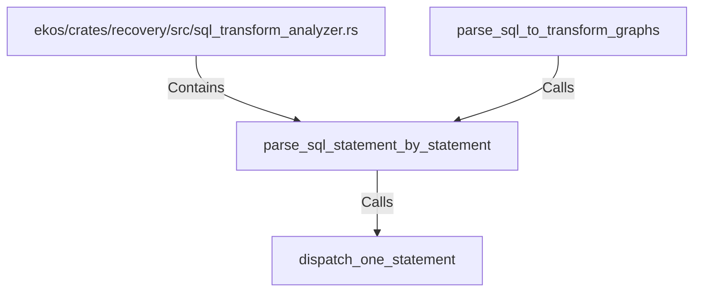

# parse_sql_statement_by_statement (RustSymbol)

## Properties

| Key | Value |
|---|---|
| `kind` | function |

## Relationships

### Calls

- ← parse_sql_to_transform_graphs (`fbbf8304-b139-51e0-bbeb-a3ae80044130`)
- → dispatch_one_statement (`23b79c8c-1748-5c88-b609-df3f07bd4779`)

### Contains

- ← ekos/crates/recovery/src/sql_transform_analyzer.rs (`987e3fbb-31ec-576d-b794-7e801336e8c8`)

## Diagram

## Evidence

_No evidence cited._
