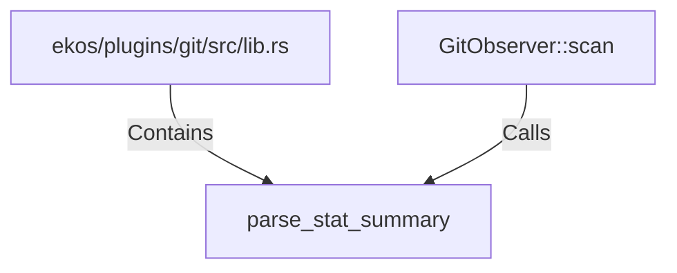

# parse_stat_summary (RustSymbol)

## Properties

| Key | Value |
|---|---|
| `kind` | function |

## Relationships

### Calls

- ← GitObserver::scan (`ef656cf7-720b-5f34-ba8a-a732bfe51c32`)

### Contains

- ← ekos/plugins/git/src/lib.rs (`8941bcba-6474-5c7b-af9e-97dc4f4f7a13`)

## Diagram

## Evidence

_No evidence cited._
