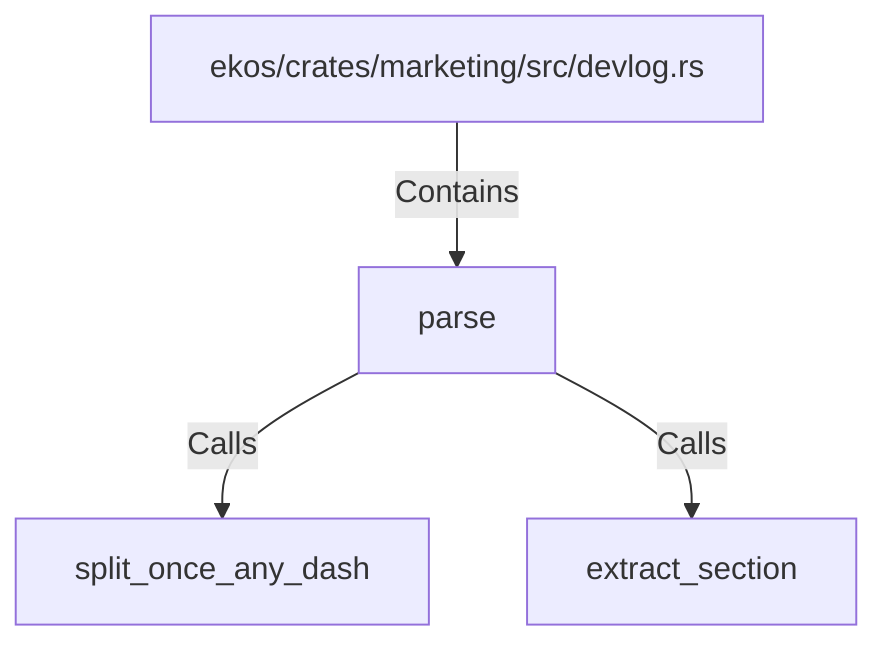

# parse (RustSymbol)

## Properties

| Key | Value |
|---|---|
| `kind` | function |

## Relationships

### Calls

- → split_once_any_dash (`48dcf9a6-293c-53ff-8cce-1ef20a74619e`)
- → extract_section (`9f6135bc-5557-5a5d-b240-e103151eb503`)

### Contains

- ← ekos/crates/marketing/src/devlog.rs (`4ca01e5b-d21d-5312-ac99-c6aa65d7d8d0`)

## Diagram

## Evidence

_No evidence cited._
