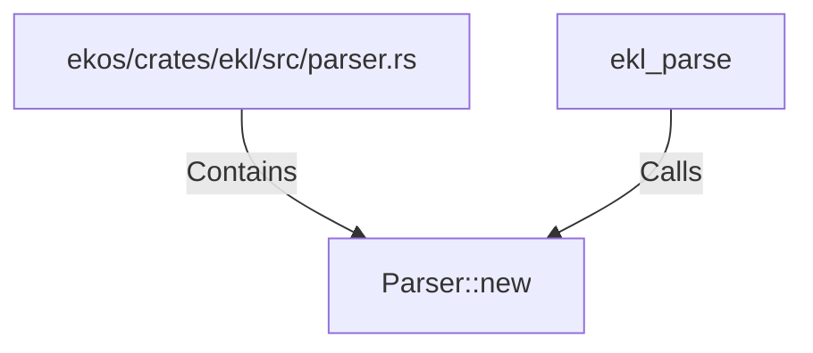

# Parser::new (RustSymbol)

## Properties

| Key | Value |
|---|---|
| `kind` | method |

## Relationships

### Calls

- ← ekl_parse (`590311ca-281e-528a-ae35-6f89aceae476`)

### Contains

- ← ekos/crates/ekl/src/parser.rs (`7eda2531-87c8-5048-92b2-c98483606431`)

## Diagram

## Evidence

_No evidence cited._
