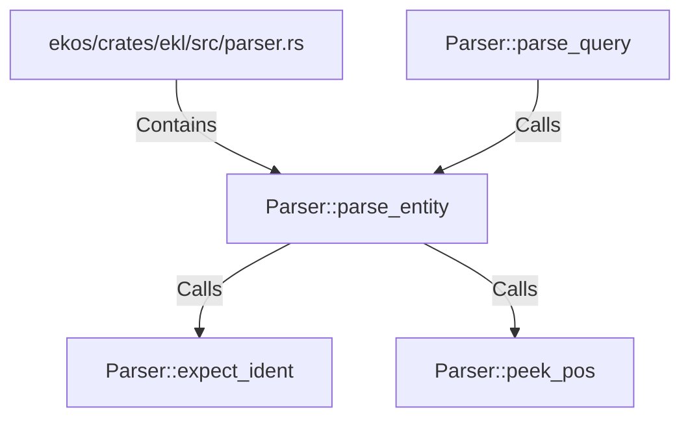

# Parser::parse_entity (RustSymbol)

## Properties

| Key | Value |
|---|---|
| `kind` | method |

## Relationships

### Calls

- ← Parser::parse_query (`4147b7b9-9d99-5be9-b91f-42752c6f6561`)
- → Parser::expect_ident (`b6c351ae-b268-5230-a6df-6a4cfd1a8f80`)
- → Parser::peek_pos (`e00f6daf-8ff4-5f41-9ac9-cdab8bb25782`)

### Contains

- ← ekos/crates/ekl/src/parser.rs (`7eda2531-87c8-5048-92b2-c98483606431`)

## Diagram

## Evidence

_No evidence cited._
