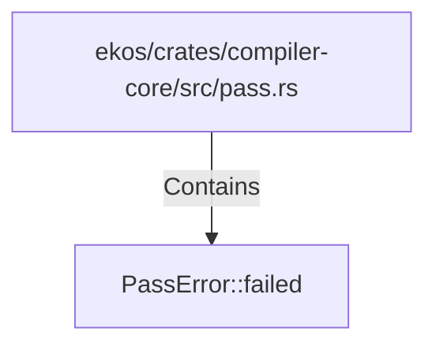

# PassError::failed (RustSymbol)

## Properties

| Key | Value |
|---|---|
| `kind` | method |

## Relationships

### Contains

- ← ekos/crates/compiler-core/src/pass.rs (`5189d0a2-3e2b-529e-adbf-3984a77be404`)

## Diagram

## Evidence

_No evidence cited._
