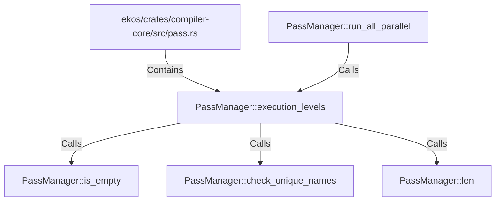

# PassManager::execution_levels (RustSymbol)

## Properties

| Key | Value |
|---|---|
| `kind` | method |

## Relationships

### Calls

- → PassManager::is_empty (`35af3903-5819-5ec3-9396-11a8a343a41c`)
- → PassManager::check_unique_names (`523e017f-a17a-520e-925d-295f0abfb465`)
- → PassManager::len (`621f7d1a-9bff-502d-9e32-1f7cbefd68e8`)
- ← PassManager::run_all_parallel (`f64251fc-07c7-5863-b006-0419e9c2f655`)

### Contains

- ← ekos/crates/compiler-core/src/pass.rs (`5189d0a2-3e2b-529e-adbf-3984a77be404`)

## Diagram

## Evidence

_No evidence cited._
