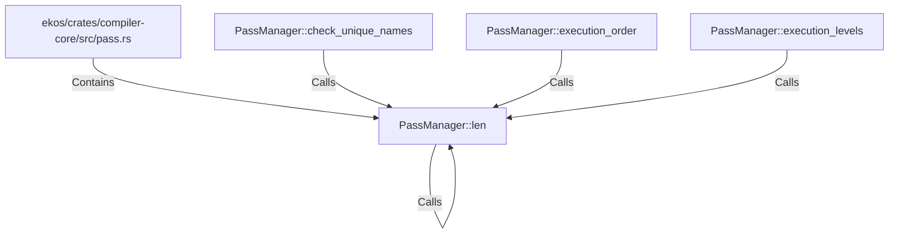

# PassManager::len (RustSymbol)

## Properties

| Key | Value |
|---|---|
| `kind` | method |

## Relationships

### Calls

- → PassManager::len (`621f7d1a-9bff-502d-9e32-1f7cbefd68e8`)
- ← PassManager::check_unique_names (`523e017f-a17a-520e-925d-295f0abfb465`)
- ← PassManager::execution_order (`293e83a5-d93e-54cf-957a-3cc539a369fe`)
- ← PassManager::execution_levels (`5b7ff059-a0b1-54d7-91b1-6fd5a3bbfe85`)

### Contains

- ← ekos/crates/compiler-core/src/pass.rs (`5189d0a2-3e2b-529e-adbf-3984a77be404`)

## Diagram

## Evidence

_No evidence cited._
