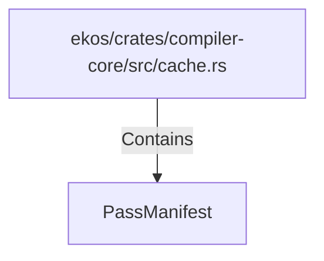

# PassManifest (RustSymbol)

## Properties

| Key | Value |
|---|---|
| `kind` | struct |

## Relationships

### Contains

- ← ekos/crates/compiler-core/src/cache.rs (`01ec80b2-6c80-5000-979c-acb288ff920a`)

## Diagram

## Evidence

_No evidence cited._
