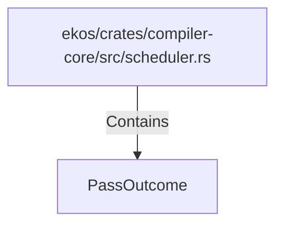

# PassOutcome (RustSymbol)

## Properties

| Key | Value |
|---|---|
| `kind` | struct |

## Relationships

### Contains

- ← ekos/crates/compiler-core/src/scheduler.rs (`973894db-35d2-59ed-b82c-30ad335125cf`)

## Diagram

## Evidence

_No evidence cited._
