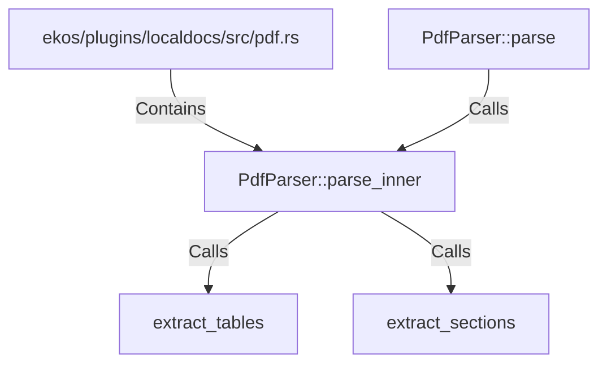

# PdfParser::parse_inner (RustSymbol)

## Properties

| Key | Value |
|---|---|
| `kind` | method |

## Relationships

### Calls

- ← PdfParser::parse (`1299777d-de94-5dcc-a207-66cde26f7a41`)
- → extract_tables (`0c7c90b3-163e-50de-80ad-2b1b6ca89b49`)
- → extract_sections (`03bcb42a-299d-5751-b9f5-0ebb5987a1ec`)

### Contains

- ← ekos/plugins/localdocs/src/pdf.rs (`c8cae073-dd9b-50d2-8942-335d3cdf47b3`)

## Diagram

## Evidence

_No evidence cited._
