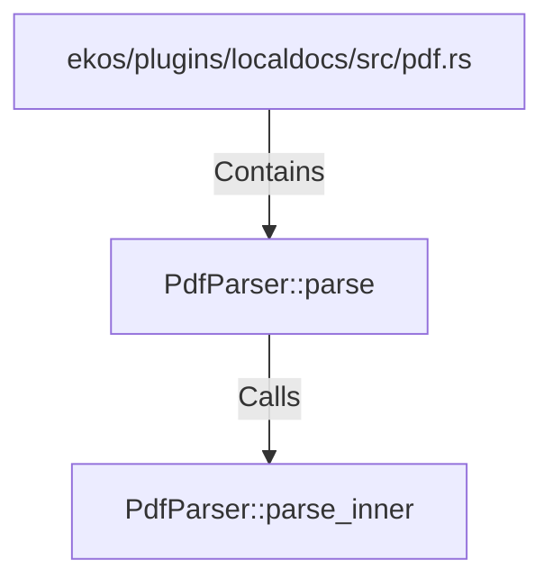

# PdfParser::parse (RustSymbol)

## Properties

| Key | Value |
|---|---|
| `kind` | method |

## Relationships

### Calls

- → PdfParser::parse_inner (`890fac4f-26ec-5bd0-af92-a13e19654f8e`)

### Contains

- ← ekos/plugins/localdocs/src/pdf.rs (`c8cae073-dd9b-50d2-8942-335d3cdf47b3`)

## Diagram

## Evidence

_No evidence cited._
