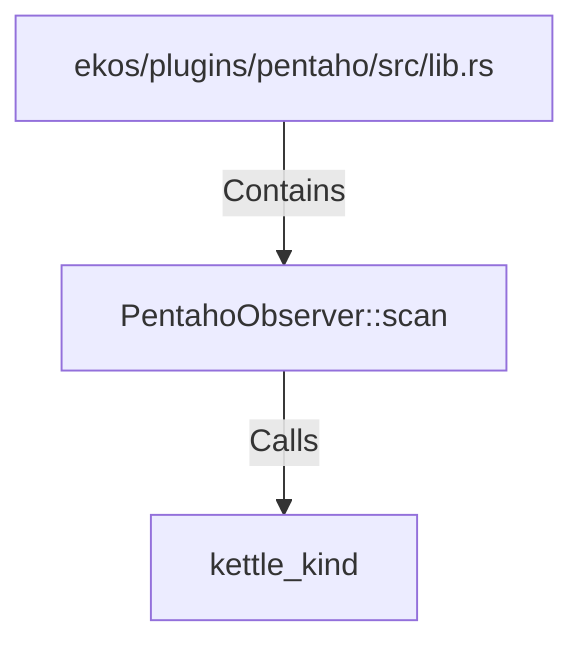

# PentahoObserver::scan (RustSymbol)

## Properties

| Key | Value |
|---|---|
| `kind` | method |

## Relationships

### Calls

- → kettle_kind (`d19562e6-cb7d-5915-aea6-f4d267c5f332`)

### Contains

- ← ekos/plugins/pentaho/src/lib.rs (`cebff2b5-8142-5508-b8ad-01561647c1cc`)

## Diagram

## Evidence

_No evidence cited._
