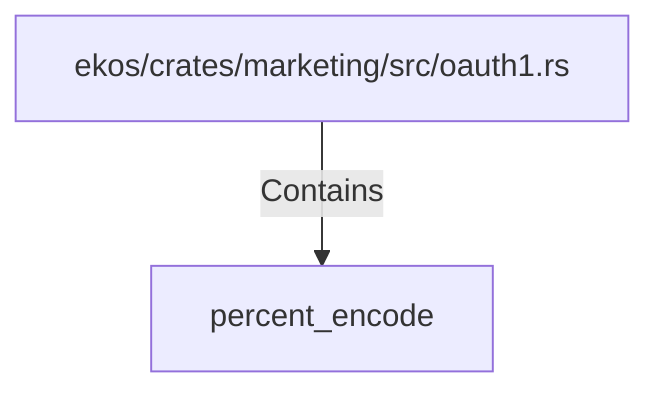

# percent_encode (RustSymbol)

## Properties

| Key | Value |
|---|---|
| `kind` | function |

## Relationships

### Contains

- ← ekos/crates/marketing/src/oauth1.rs (`d9547f96-f031-5a9d-875d-5912db96b474`)

## Diagram

## Evidence

_No evidence cited._
