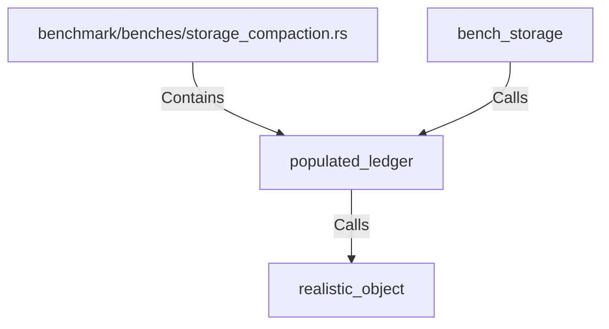

# populated_ledger (RustSymbol)

## Properties

| Key | Value |
|---|---|
| `kind` | function |

## Relationships

### Calls

- → realistic_object (`0bf4f5af-e90c-51c5-87ef-f5bd09bac74b`)
- ← bench_storage (`862cdfdb-c2a7-5c97-bfdc-c5116b2d9737`)

### Contains

- ← benchmark/benches/storage_compaction.rs (`7c6dcc8e-035b-5a69-89a6-a45e962f93d8`)

## Diagram

## Evidence

_No evidence cited._
