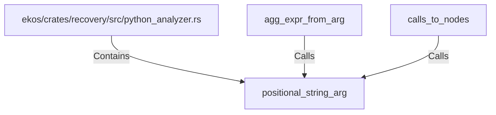

# positional_string_arg (RustSymbol)

## Properties

| Key | Value |
|---|---|
| `kind` | function |

## Relationships

### Calls

- ← agg_expr_from_arg (`af6d61cf-82a1-5958-997d-ebec6bf9b6f3`)
- ← calls_to_nodes (`73d9612b-4af4-5e0f-b10f-ddfc27015e27`)

### Contains

- ← ekos/crates/recovery/src/python_analyzer.rs (`196ca3fd-e85c-5ab9-a142-50f63dc586b9`)

## Diagram

## Evidence

_No evidence cited._
