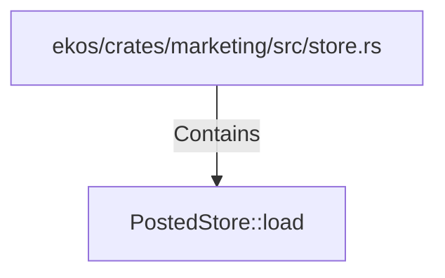

# PostedStore::load (RustSymbol)

## Properties

| Key | Value |
|---|---|
| `kind` | method |

## Relationships

### Contains

- ← ekos/crates/marketing/src/store.rs (`87860e47-e5db-5450-a233-7e7fe0c46d89`)

## Diagram

## Evidence

_No evidence cited._
