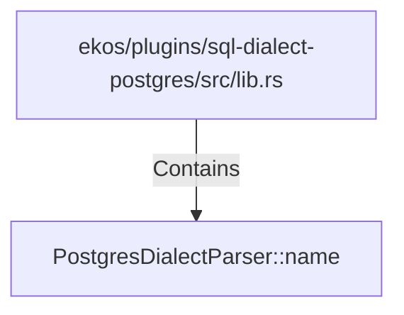

# PostgresDialectParser::name (RustSymbol)

## Properties

| Key | Value |
|---|---|
| `kind` | method |

## Relationships

### Contains

- ← ekos/plugins/sql-dialect-postgres/src/lib.rs (`4635063b-44e9-5cfb-97e8-4e39451ffe73`)

## Diagram

## Evidence

_No evidence cited._
