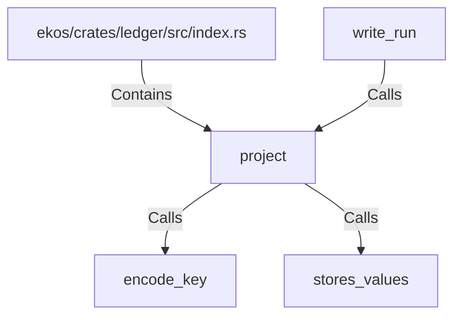

# project (RustSymbol)

## Properties

| Key | Value |
|---|---|
| `kind` | function |

## Relationships

### Calls

- → encode_key (`5f3049a2-8e65-5510-9ee3-ab92690f254a`)
- → stores_values (`bd8d2a77-ff4c-5ab3-b99f-39afccdb9f6e`)
- ← write_run (`944c015c-ad50-5e55-9238-7d57ee4ed67b`)

### Contains

- ← ekos/crates/ledger/src/index.rs (`a43fa387-2cac-5166-bfc2-ae4c965fc2ac`)

## Diagram

## Evidence

_No evidence cited._
