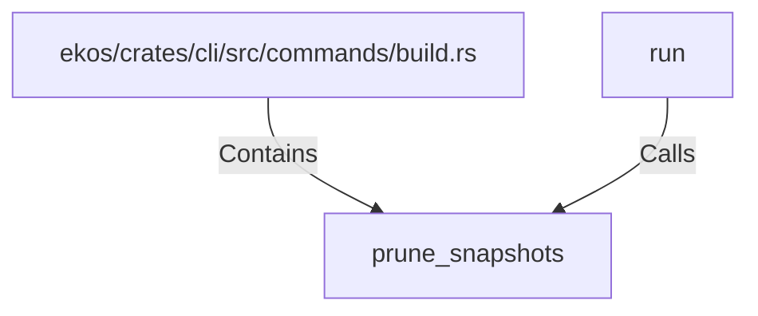

# prune_snapshots (RustSymbol)

## Properties

| Key | Value |
|---|---|
| `kind` | function |

## Relationships

### Calls

- ← run (`d09318f4-bb3c-5be7-9348-151887565314`)

### Contains

- ← ekos/crates/cli/src/commands/build.rs (`306def2e-bd5a-5784-9453-692c119e8d43`)

## Diagram

## Evidence

_No evidence cited._
