# push (RustSymbol)

## Properties

| Key | Value |
|---|---|
| `kind` | function |

## Relationships

### Calls

- ← dispatch_one_statement (`23b79c8c-1748-5c88-b609-df3f07bd4779`)
- ← select_to_graph (`cb80b4b3-9be9-5aae-828e-f0d4f3ec4336`)
- ← table_factor_node (`e24f2073-e41e-5300-bc61-d0729092e131`)
- ← join_node (`7eaa67f6-5bf6-5400-9b69-a65cf91f7e66`)
- ← procedure_body_to_graph (`7ec44c96-a38e-5bf5-8c0f-3683d9b61662`)
- ← function_to_graph (`fb4a63c1-3690-5bee-b424-6e26e9a46525`)

### Contains

- ← ekos/crates/recovery/src/sql_transform_analyzer.rs (`987e3fbb-31ec-576d-b794-7e801336e8c8`)

## Diagram

```mermaid
graph TD
    ncc223cbc9afd50869f888c6d484895d1["push"]
    n987e3fbb31ec576db7947e801336e8c8["ekos/crates/recovery/src/sql_transform_analyzer.rs"]
    n987e3fbb31ec576db7947e801336e8c8 -->|Contains| ncc223cbc9afd50869f888c6d484895d1
    n23b79c8c17485c88b609df3f07bd4779["dispatch_one_statement"]
    n23b79c8c17485c88b609df3f07bd4779 -->|Calls| ncc223cbc9afd50869f888c6d484895d1
    ncb80b4b39be95aae828ef0d4f3ec4336["select_to_graph"]
    ncb80b4b39be95aae828ef0d4f3ec4336 -->|Calls| ncc223cbc9afd50869f888c6d484895d1
    ne24f2073e41e5300bc61d0729092e131["table_factor_node"]
    ne24f2073e41e5300bc61d0729092e131 -->|Calls| ncc223cbc9afd50869f888c6d484895d1
    n7eaa67f65bf654009b69a65cf91f7e66["join_node"]
    n7eaa67f65bf654009b69a65cf91f7e66 -->|Calls| ncc223cbc9afd50869f888c6d484895d1
    n7ec44c96a38e5bf58c0f3683d9b61662["procedure_body_to_graph"]
    n7ec44c96a38e5bf58c0f3683d9b61662 -->|Calls| ncc223cbc9afd50869f888c6d484895d1
    nfb4a63c136905beeb4246e26e9a46525["function_to_graph"]
    nfb4a63c136905beeb4246e26e9a46525 -->|Calls| ncc223cbc9afd50869f888c6d484895d1
```

## Evidence

_No evidence cited._
