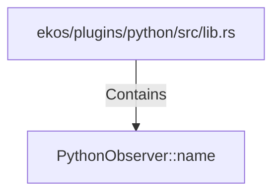

# PythonObserver::name (RustSymbol)

## Properties

| Key | Value |
|---|---|
| `kind` | method |

## Relationships

### Contains

- ← ekos/plugins/python/src/lib.rs (`a3158b70-7e78-5501-8593-4a22c3e9c266`)

## Diagram

## Evidence

_No evidence cited._
