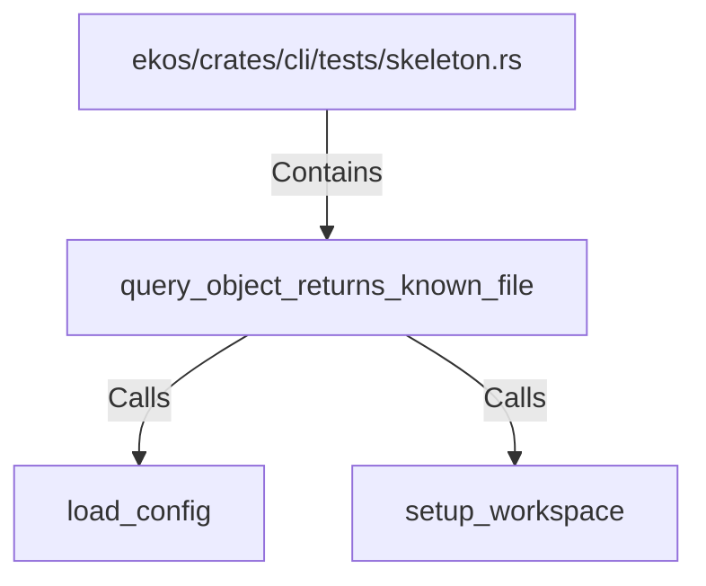

# query_object_returns_known_file (RustSymbol)

## Properties

| Key | Value |
|---|---|
| `kind` | function |

## Relationships

### Calls

- → load_config (`d1e71ee3-4e17-5050-81bd-5dd6a8cafafe`)
- → setup_workspace (`f8f102ad-bfb4-5854-8fb6-2200db5a7daf`)

### Contains

- ← ekos/crates/cli/tests/skeleton.rs (`c39b7026-a223-5e82-b5c8-7ed254f6ba84`)

## Diagram

## Evidence

_No evidence cited._
