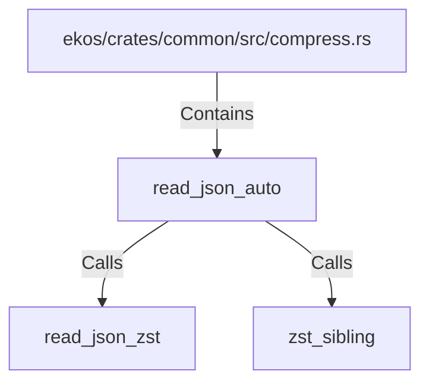

# read_json_auto (RustSymbol)

## Properties

| Key | Value |
|---|---|
| `kind` | function |

## Relationships

### Calls

- → read_json_zst (`1567b100-c499-5068-8613-ef76e744a280`)
- → zst_sibling (`eddec3cb-1d3e-5218-8af7-3692a9d8531d`)

### Contains

- ← ekos/crates/common/src/compress.rs (`99637da4-0489-5fca-ba15-b1144f48c3cc`)

## Diagram

## Evidence

_No evidence cited._
