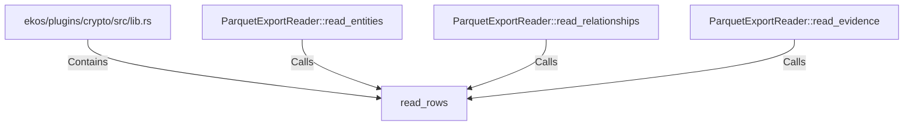

# read_rows (RustSymbol)

## Properties

| Key | Value |
|---|---|
| `kind` | function |

## Relationships

### Calls

- ← ParquetExportReader::read_entities (`f0b31d24-4edc-544e-96ac-fc790b32605d`)
- ← ParquetExportReader::read_relationships (`c79b4df5-78e2-5990-a627-2851c1a75901`)
- ← ParquetExportReader::read_evidence (`52ef400c-3e08-57e7-9937-27669b2386fa`)

### Contains

- ← ekos/plugins/crypto/src/lib.rs (`83728c61-df4d-5ad6-81c7-5bf50ff761fb`)

## Diagram

## Evidence

_No evidence cited._
