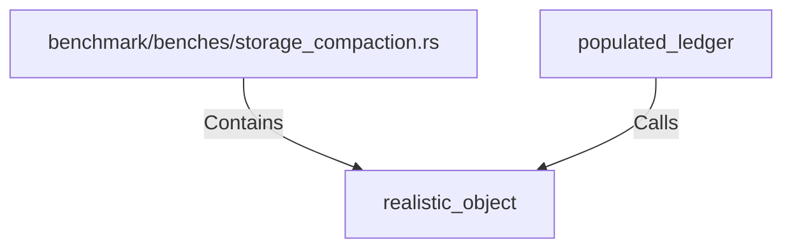

# realistic_object (RustSymbol)

## Properties

| Key | Value |
|---|---|
| `kind` | function |

## Relationships

### Calls

- ← populated_ledger (`e4c4b382-b7a8-519e-a960-5b6bcfa5ea64`)

### Contains

- ← benchmark/benches/storage_compaction.rs (`7c6dcc8e-035b-5a69-89a6-a45e962f93d8`)

## Diagram

## Evidence

_No evidence cited._
