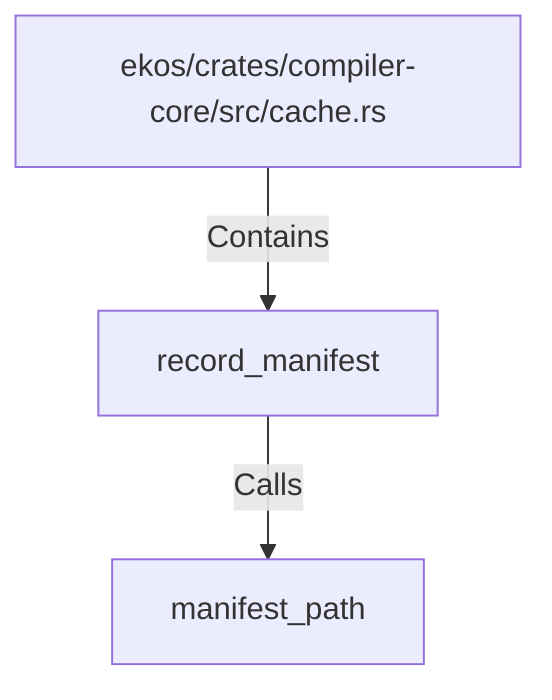

# record_manifest (RustSymbol)

## Properties

| Key | Value |
|---|---|
| `kind` | function |

## Relationships

### Calls

- → manifest_path (`aa7a9c52-8f67-50f6-a1eb-13a372078457`)

### Contains

- ← ekos/crates/compiler-core/src/cache.rs (`01ec80b2-6c80-5000-979c-acb288ff920a`)

## Diagram

## Evidence

_No evidence cited._
