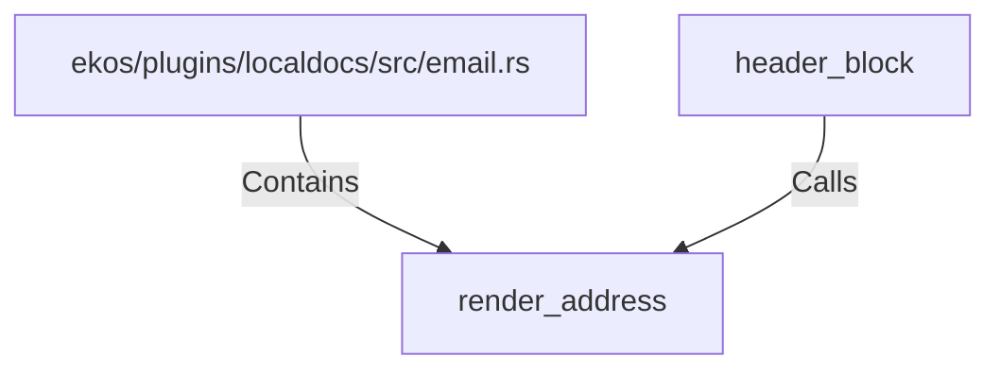

# render_address (RustSymbol)

## Properties

| Key | Value |
|---|---|
| `kind` | function |

## Relationships

### Calls

- ← header_block (`5e7be91d-4d37-5e3e-b041-33ece5b9675c`)

### Contains

- ← ekos/plugins/localdocs/src/email.rs (`fbdd8fb1-8ac2-5e5d-b95b-c1d0451eae6e`)

## Diagram

## Evidence

_No evidence cited._
