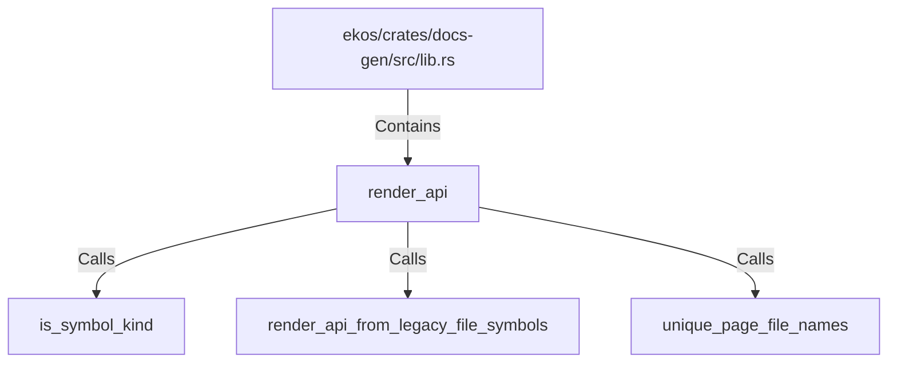

# render_api (RustSymbol)

## Properties

| Key | Value |
|---|---|
| `kind` | function |

## Relationships

### Calls

- → is_symbol_kind (`c6edd30c-c121-5dad-95d2-155f5391c723`)
- → render_api_from_legacy_file_symbols (`7dbba924-067b-5b9c-9975-9e223d01dc4c`)
- → unique_page_file_names (`136d1c6d-e6f6-5cda-97d8-3454bbc0d5e7`)

### Contains

- ← ekos/crates/docs-gen/src/lib.rs (`6ca4fba0-18e5-59b7-9876-7dae72e2ce0e`)

## Diagram

## Evidence

_No evidence cited._
