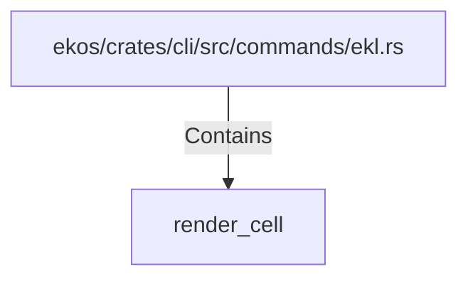

# render_cell (RustSymbol)

## Properties

| Key | Value |
|---|---|
| `kind` | function |

## Relationships

### Contains

- ← ekos/crates/cli/src/commands/ekl.rs (`bc65014d-7e0a-5fdc-8a2b-fde4edce2935`)

## Diagram

## Evidence

_No evidence cited._
