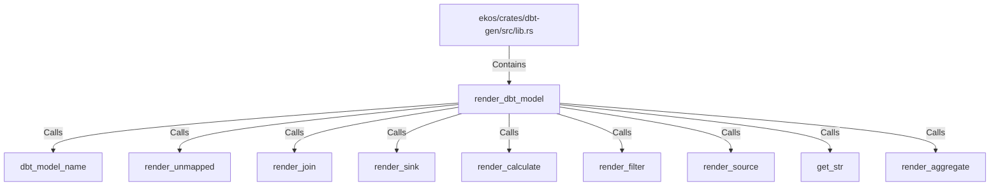

# render_dbt_model (RustSymbol)

## Properties

| Key | Value |
|---|---|
| `kind` | function |

## Relationships

### Calls

- → dbt_model_name (`4e0e3bc6-d261-5d55-a9da-1bd8f3173cf8`)
- → render_unmapped (`130a2e45-93d9-563f-b669-b7e6e8bd7900`)
- → render_join (`38a7c372-2ec4-5a38-a5fd-53f7c4bbf55c`)
- → render_sink (`f037d176-e9fa-5cab-a531-f7995e09727b`)
- → render_calculate (`b7519843-e48d-57b7-ac81-6fdf21a72cdd`)
- → render_filter (`4976bdef-e8ee-5e02-9603-fe82d738e9c7`)
- → render_source (`02d30b92-2113-5cbb-8b26-27374d4a83c9`)
- → get_str (`92ef0b6b-150b-5f26-bfbd-07900bf340c8`)
- → render_aggregate (`f5e30215-3166-5317-b596-b7e4503b3607`)

### Contains

- ← ekos/crates/dbt-gen/src/lib.rs (`20d45ed0-c411-592d-8034-6486682f898c`)

## Diagram

## Evidence

_No evidence cited._
