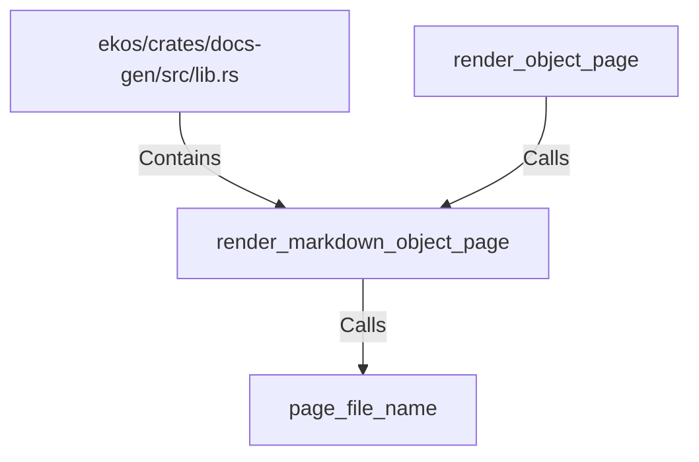

# render_markdown_object_page (RustSymbol)

## Properties

| Key | Value |
|---|---|
| `kind` | function |

## Relationships

### Calls

- ← render_object_page (`cdc18413-eaf9-5b53-9989-839fc52293c1`)
- → page_file_name (`d8b69d99-022e-532f-988b-43e4370b5981`)

### Contains

- ← ekos/crates/docs-gen/src/lib.rs (`6ca4fba0-18e5-59b7-9876-7dae72e2ce0e`)

## Diagram

## Evidence

_No evidence cited._
