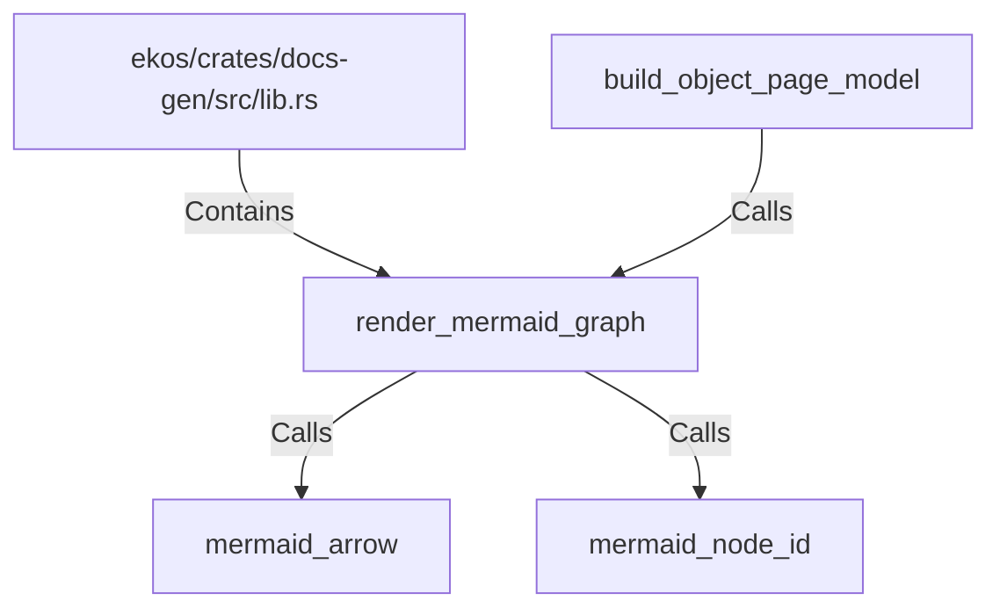

# render_mermaid_graph (RustSymbol)

## Properties

| Key | Value |
|---|---|
| `kind` | function |

## Relationships

### Calls

- ← build_object_page_model (`0b9a022b-a905-5064-bb70-9f4e04f76875`)
- → mermaid_arrow (`4a306dc2-d546-5c1c-a4d6-8cf1053971f7`)
- → mermaid_node_id (`6da0d0ba-0c8b-5a4e-bb6f-a414381854d9`)

### Contains

- ← ekos/crates/docs-gen/src/lib.rs (`6ca4fba0-18e5-59b7-9876-7dae72e2ce0e`)

## Diagram

## Evidence

_No evidence cited._
