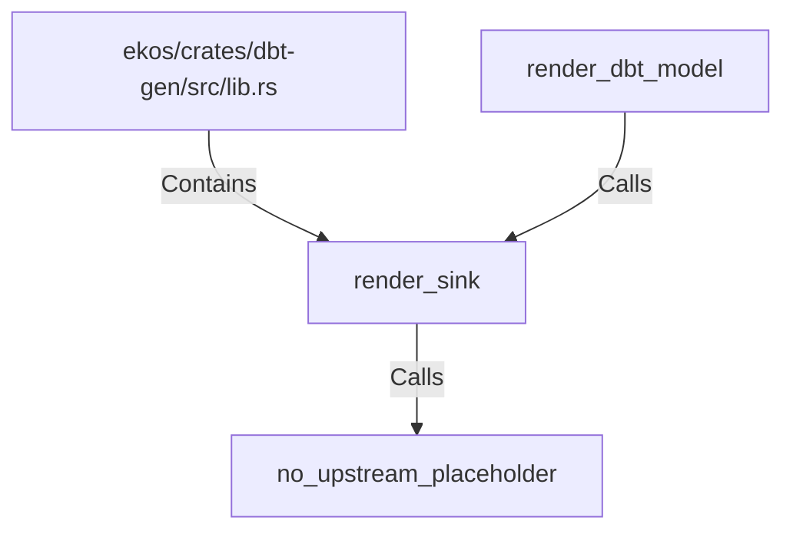

# render_sink (RustSymbol)

## Properties

| Key | Value |
|---|---|
| `kind` | function |

## Relationships

### Calls

- ← render_dbt_model (`95ef6862-37ab-54fa-99de-4e67f2dffd69`)
- → no_upstream_placeholder (`0a8b417e-5dc9-5199-9efe-5d7b8d2b02b5`)

### Contains

- ← ekos/crates/dbt-gen/src/lib.rs (`20d45ed0-c411-592d-8034-6486682f898c`)

## Diagram

## Evidence

_No evidence cited._
