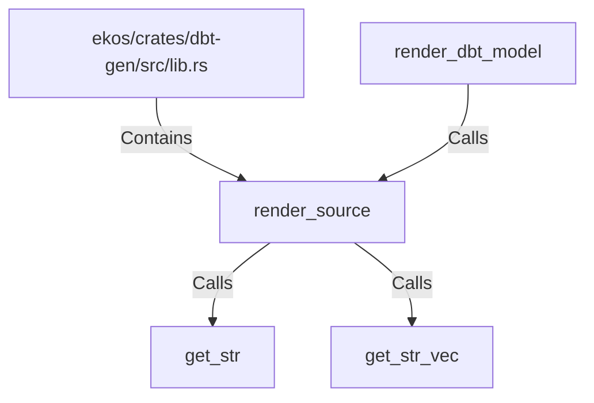

# render_source (RustSymbol)

## Properties

| Key | Value |
|---|---|
| `kind` | function |

## Relationships

### Calls

- ← render_dbt_model (`95ef6862-37ab-54fa-99de-4e67f2dffd69`)
- → get_str (`92ef0b6b-150b-5f26-bfbd-07900bf340c8`)
- → get_str_vec (`3cb9bf32-bfc0-5c54-b647-de3f7ed2c4ae`)

### Contains

- ← ekos/crates/dbt-gen/src/lib.rs (`20d45ed0-c411-592d-8034-6486682f898c`)

## Diagram

## Evidence

_No evidence cited._
