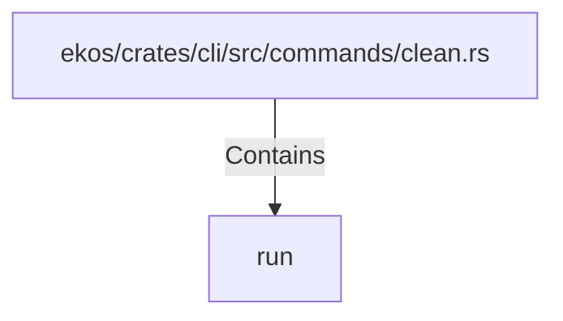

# run (RustSymbol)

## Properties

| Key | Value |
|---|---|
| `kind` | function |

## Relationships

### Contains

- ← ekos/crates/cli/src/commands/clean.rs (`0ccb7d47-8c4d-5547-bbd5-24f7701fb4e7`)

## Diagram

## Evidence

_No evidence cited._
