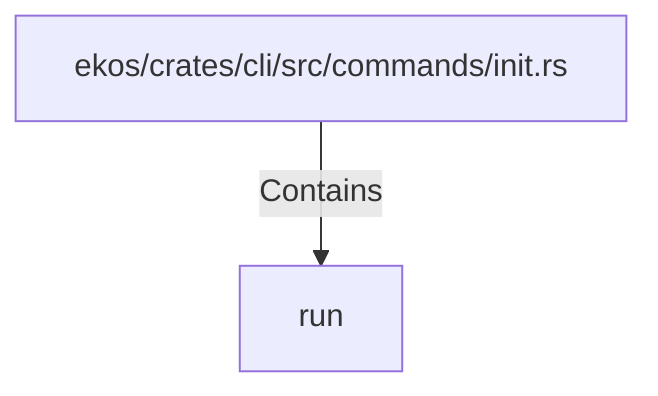

# run (RustSymbol)

## Properties

| Key | Value |
|---|---|
| `kind` | function |

## Relationships

### Contains

- ← ekos/crates/cli/src/commands/init.rs (`4ed5ca6d-a35f-5cde-a080-af09a742cfb9`)

## Diagram

## Evidence

_No evidence cited._
