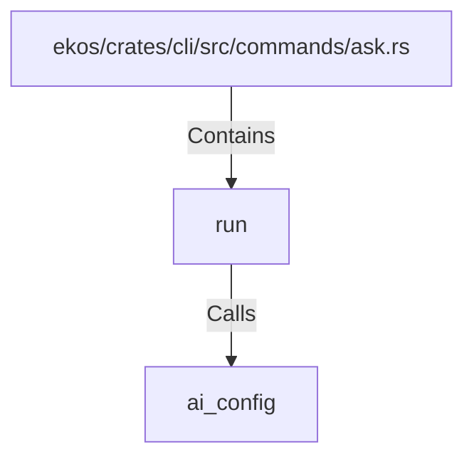

# run (RustSymbol)

## Properties

| Key | Value |
|---|---|
| `kind` | function |

## Relationships

### Calls

- → ai_config (`2292821d-a8c3-51f1-8c3d-2719063b3e03`)

### Contains

- ← ekos/crates/cli/src/commands/ask.rs (`e7e75efa-39cb-5182-b056-2fd16dfdc739`)

## Diagram

## Evidence

_No evidence cited._
