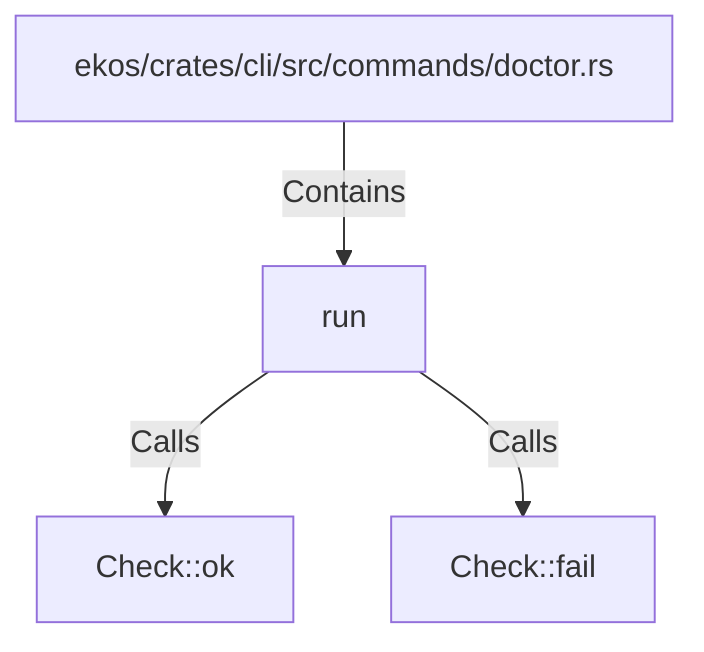

# run (RustSymbol)

## Properties

| Key | Value |
|---|---|
| `kind` | function |

## Relationships

### Calls

- → Check::ok (`5da0003d-2839-5411-a0da-7f330c797391`)
- → Check::fail (`2825aa30-cb08-5ec6-9b4b-65a4a8900de9`)

### Contains

- ← ekos/crates/cli/src/commands/doctor.rs (`117003db-05ca-5009-9ea3-90c845aff5f4`)

## Diagram

## Evidence

_No evidence cited._
