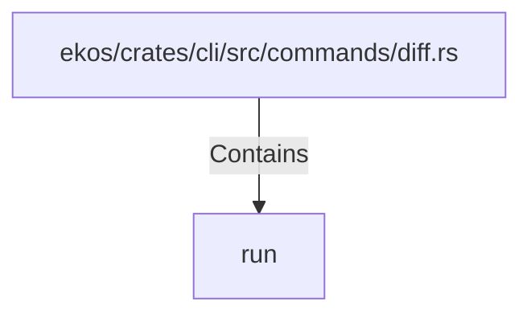

# run (RustSymbol)

## Properties

| Key | Value |
|---|---|
| `kind` | function |

## Relationships

### Contains

- ← ekos/crates/cli/src/commands/diff.rs (`162a5e91-5e60-5951-9a1c-14c60cd6109b`)

## Diagram

## Evidence

_No evidence cited._
