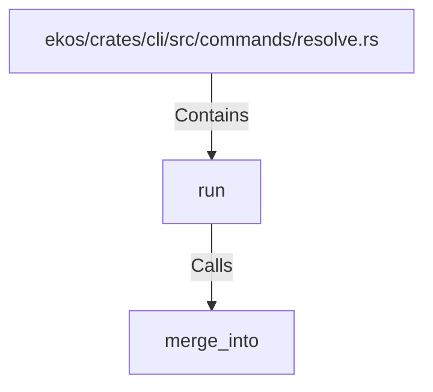

# run (RustSymbol)

## Properties

| Key | Value |
|---|---|
| `kind` | function |

## Relationships

### Calls

- → merge_into (`9e49b883-2e89-50e9-ac09-960ffefbd612`)

### Contains

- ← ekos/crates/cli/src/commands/resolve.rs (`6b6902bf-7bb5-59f8-a210-ce0acd18d7ec`)

## Diagram

## Evidence

_No evidence cited._
