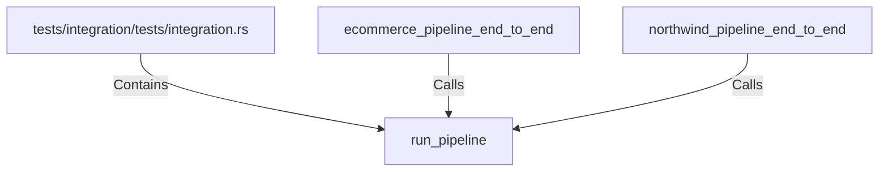

# run_pipeline (RustSymbol)

## Properties

| Key | Value |
|---|---|
| `kind` | function |

## Relationships

### Calls

- ← ecommerce_pipeline_end_to_end (`a57c4f64-6fb8-58be-aa29-7c411ae6f5ad`)
- ← northwind_pipeline_end_to_end (`2cb9f53e-f55a-510f-ab72-1dcea04bc856`)

### Contains

- ← tests/integration/tests/integration.rs (`23e9eb43-c8df-52b5-a581-f2efba7085ea`)

## Diagram

## Evidence

_No evidence cited._
